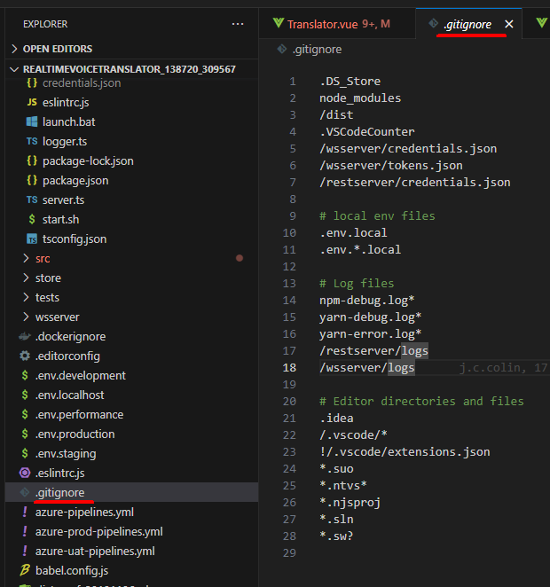

# Git
以下の内容を読んだ上、問題を回答してください。  
## バージョン管理に関して
[Git - バージョン管理に関して](https://git-scm.com/book/ja/v2/%E4%BD%BF%E3%81%84%E5%A7%8B%E3%82%81%E3%82%8B-%E3%83%90%E3%83%BC%E3%82%B8%E3%83%A7%E3%83%B3%E7%AE%A1%E7%90%86%E3%81%AB%E9%96%A2%E3%81%97%E3%81%A6)  
1. バージョン管理とは何か？  
1-A  
一つのファイルやファイルの集合に対して、時間とともに加えられていく変更を記録するシステム。特定のバージョンを呼び出すことができる。
2. バージョン管理の管理手法は幾つかを挙げられました。それぞれを簡単に紹介してみてください。 
2-A   
__2-1. ローカル管理システム__  
  リビジョン間のパッチ(ファイル間の差分)の集合情報をディスク上に保持する方法。過去の任意の時点でのファイルの状態をパッチを重ね挙げていくことで再現できる。  
2-2. 集中バージョン管理システム(CVCS)  
  バージョン管理されたファイルをCentral VCS Server一か所で管理し、他のシステムからファイルにチェックアウトする方法。複数のシステムで共同開発をする時に有効。開発メンバの作業内容の把握やアクセスコントロールも容易に行える。ただし、マスタデータが一か所にあるため、障害発生時のリスクが大きいという欠点がある。  
2-3. 分散バージョン管理システム(DVCS)  
  クライアントがファイルの最新スナップショットを✓アウトする際に、リポジトリ全体をミラーリングする方法。これにより、メインサーバが子そうしたとしても、クライアント・リポジトリの一つ確保できれば、完全なバックアップとして利用できる。

## Git基本
[Git - Git略史](https://git-scm.com/book/ja/v2/%E4%BD%BF%E3%81%84%E5%A7%8B%E3%82%81%E3%82%8B-Git%E7%95%A5%E5%8F%B2)  
[Git - Gitの基本](https://git-scm.com/book/ja/v2/%E4%BD%BF%E3%81%84%E5%A7%8B%E3%82%81%E3%82%8B-Git%E3%81%AE%E5%9F%BA%E6%9C%AC)  
1. Gitの作成者は誰？どのようなきっかけでGitを作ろうとしたでしょう？  
1-A. 作成者はLinus Torvalds。Linuxカーネルという巨大な範囲のオープンソース・ソフトウェア・プロジェクトの中でBitKeeperというDVCSを無料で使っていたが、その無料利用が取り消されたことをきっかけに、BitKeeperの利用を取りやめ自分たちで新しいシステムを作成した。
2. Gitのを作る時当時にはどうな目標があったのでしょうか？  
2-A. Gitを作る時の目標は以下  
- スピード
- シンプルな設計
- ノンリニア開発(数千の並列ブランチを作成するような開発)への強力なサポート
- 完全な分散
- Linuxカーネルのような大規模プロジェクトを効率的に取り扱い可能
3. Gitと他のVCS (Subversionとその類を含む)の主要な相違はなんでしょうか。説明してみてください。  
3-A. Gitはファイル全体のスナップショットを保存するのに対し、他のVCSでは変更されたファイルの変更内容を保存する。そのため、他のVCSではネットワークに接続してファイルを操作する必要があるが、Gitの場合はローカルで遅延なく操作が可能である。
4. Gitの三つの状態はどの三つであります？  
4-A. 三つの状態は以下
- 修正済: ローカルでファイルに変更を加えた状態。ローカルでデータを自由に変更でき、変更内容がgitディレクトリに影響していない。
- ステージ済: 修正されたファイルのスナップショットをステージングエリアに追加した状態
- コミット済: 修正されたファイルのスナップショットがgitディレクトリに反映された状態

[Git - Git リポジトリの取得](https://git-scm.com/book/ja/v2/Git-%E3%81%AE%E5%9F%BA%E6%9C%AC-Git-%E3%83%AA%E3%83%9D%E3%82%B8%E3%83%88%E3%83%AA%E3%81%AE%E5%8F%96%E5%BE%97)  
1. Gitによって管理されているかどうかは、あるファイルが存在しているかで判断されます。どのファイルでしょうか？  
1-A.".git"  ("git init"を実行すると作られる)


[Git - 変更内容のリポジトリへの記録](https://git-scm.com/book/ja/v2/Git-%E3%81%AE%E5%9F%BA%E6%9C%AC-%E5%A4%89%E6%9B%B4%E5%86%85%E5%AE%B9%E3%81%AE%E3%83%AA%E3%83%9D%E3%82%B8%E3%83%88%E3%83%AA%E3%81%B8%E3%81%AE%E8%A8%98%E9%8C%B2)  
1. `git status`コマンドは何かできます？  
1-A. ファイルの状態の確認。  
今いるブランチ、変更されたファイル、追跡されていない(スナップショットが存在しない)ファイル、ステージされたファイルなど
2. `git add`コマンドは何かできます？  
2-A. 追跡するファイルの追加。  
スナップショットが保存され、追跡が可能になる。
3. ファイルを無視したい場合、どうすればいいですか？  
3-A. .gitignoreファイルに無視したいファイルやそのパターンを格納する。  
作業中に自動生成されてしまうファイルなどを間違ってgitリポジトリにコミットしてしまう事故を防ぐことができる。  
一般的に .gitignore ファイルには機密情報などを含めることがよくあります。GitHubで自分のコードを公開する場合でも、APIキーやその他の機密情報は別のファイルに保存し、.gitignore 
image.png
に指定しておく必要があります。
このファイルはRTVTでも使われている

4. `git commit`コマンドは何かできます？  
4-A. 変更内容のgitリポジトリへのコミット。  
変更したファイルをステージング  
-> "git commit"コマンド  
-> エディタが立ち上がり、コミットメッセージを記入  
-> エディタを終了  
-> コミット完了  
ステージされていないファイルのへんこうは記録されない。
5. ファイル名を変更したの場合、gitにどう変更を記録すればいい？  
5-A. mvコマンドを使う。  
gitはファイル単位でデータを保存しているため、ファイル名を変更した場合、"変更前ファイル名"が削除され、"変更後ファイル名"が作成されたと認識する。そのため、"変更前ファイル名"への過去の変更履歴は"変更後ファイル名"へは引き継がれない。それを解消するために、以下のコマンドを使える。
```git
git mv file_from file_to
```
または、
```git
mv file_from file_to
git rm file_from
git add file_to
```

## オプション
[Git - Gitのインストール](https://git-scm.com/book/ja/v2/%E4%BD%BF%E3%81%84%E5%A7%8B%E3%82%81%E3%82%8B-Git%E3%81%AE%E3%82%A4%E3%83%B3%E3%82%B9%E3%83%88%E3%83%BC%E3%83%AB)  
[Git - コミット履歴の閲覧](https://git-scm.com/book/ja/v2/Git-%E3%81%AE%E5%9F%BA%E6%9C%AC-%E3%82%B3%E3%83%9F%E3%83%83%E3%83%88%E5%B1%A5%E6%AD%B4%E3%81%AE%E9%96%B2%E8%A6%A7)  
[Git - 作業のやり直し](https://git-scm.com/book/ja/v2/Git-%E3%81%AE%E5%9F%BA%E6%9C%AC-%E4%BD%9C%E6%A5%AD%E3%81%AE%E3%82%84%E3%82%8A%E7%9B%B4%E3%81%97)
[Git - リモートでの作業](https://git-scm.com/book/ja/v2/Git-%E3%81%AE%E5%9F%BA%E6%9C%AC-%E3%83%AA%E3%83%A2%E3%83%BC%E3%83%88%E3%81%A7%E3%81%AE%E4%BD%9C%E6%A5%AD)  
[Git - タグ](https://git-scm.com/book/ja/v2/Git-%E3%81%AE%E5%9F%BA%E6%9C%AC-%E3%82%BF%E3%82%B0)